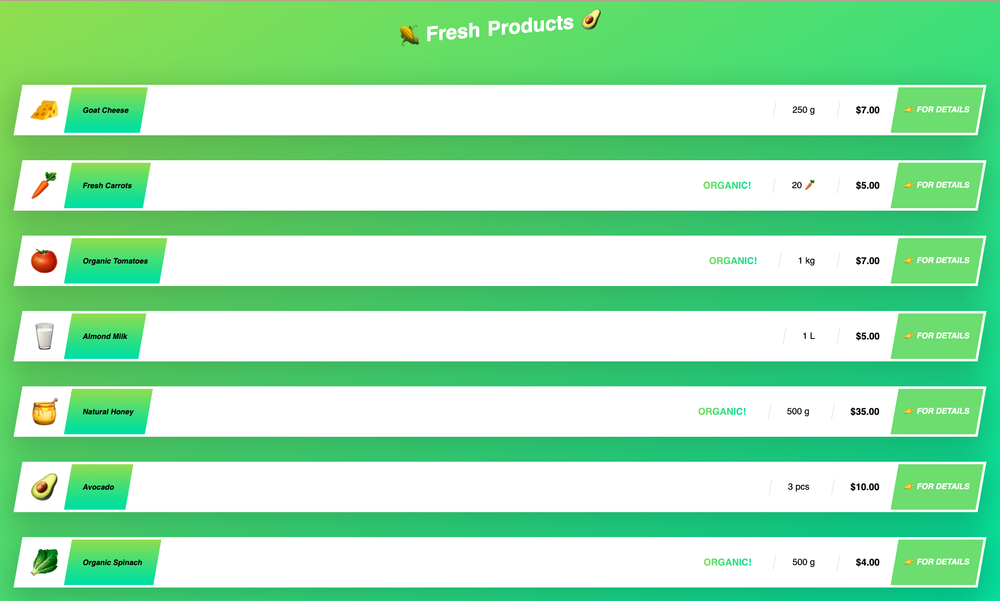
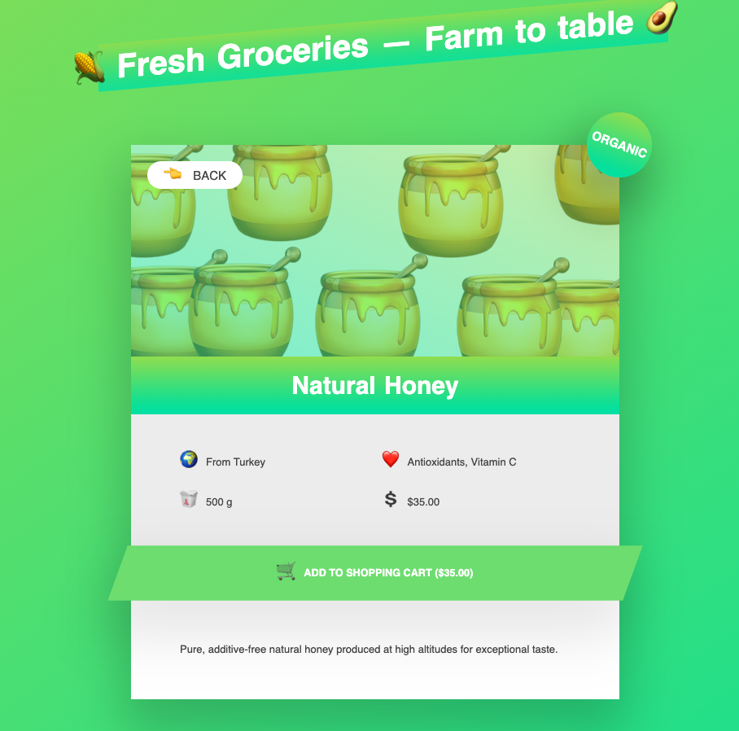

# farm-fresh-groceries
**Node.js app that serves a grocery overview and per-product pages using plain HTML templates and JSON data.**  

# Demo

## Screenshots

## Technologies Used
- **Node.js (v18+)** 
- **Vanilla JavaScript templating** 
- **HTML5** 
- **JSON data source** 
- **nodemon**
